## 目次

- [プロジェクト概要](#page-1)
- [利用方法](#page-2)
- [システム全体構成図](#page-3)
- [コンポーネント関係図](#page-4)
- [文字認識（OCR）機能](#page-5)
- [文字領域検出・分割機能](#page-6)
- [データフローと入出力仕様](#page-7)
- [バックエンド処理の詳細](#page-8)
- [AIモデル統合と管理](#page-9)
- [デプロイ方法とインフラ要件](#page-10)
- [拡張・カスタマイズ方法](#page-11)

<a id='page-1'></a>

## プロジェクト概要

### 関連ページ

関連トピック: [利用方法](#page-2)

<details>
<summary>関連するソースファイル</summary>

このWikiページを生成するために使用されたファイルは以下の通りです：

- [readme.md](readme.md)
- [LICENSE](LICENSE)
- [src/main.cpp](src/main.cpp)
- [src/ocr.cpp](src/ocr.cpp)
- [src/ocr.h](src/ocr.h)
- [src/util.cpp](src/util.cpp)
- [src/util.h](src/util.h)
</details>

# プロジェクト概要

OCR_Japaneaseは、日本語画像文字認識（OCR）を目的としたC++ベースのデスクトップアプリケーションです。主に画像ファイルから日本語テキストを抽出する機能を提供し、軽量かつ高速な動作を特徴としています。  
本プロジェクトは、独自の画像処理アルゴリズムと日本語文字認識エンジンを実装しており、コマンドラインからの利用が可能です。  
ソース: [readme.md:1-20](), [src/main.cpp:1-50]()

## アーキテクチャ概要
OCR_Japaneaseは、以下の主要コンポーネントで構成されています。

| コンポーネント   | 説明                               | 主な実装ファイル          |
|:-----------------|:-----------------------------------|:-------------------------|
| mainエントリーポイント | コマンドライン引数の解析と処理開始 | src/main.cpp             |
| OCRエンジン      | 画像から文字を抽出するコア機能      | src/ocr.cpp, src/ocr.h   |
| ユーティリティ   | ファイル入出力・画像処理補助関数    | src/util.cpp, src/util.h |

ソース: [src/main.cpp:1-50](), [src/ocr.cpp:1-200](), [src/util.cpp:1-80]()

### システム全体フロー

以下は、OCR_Japaneaseのシステム全体処理フローを示すMermaidダイアグラムです。

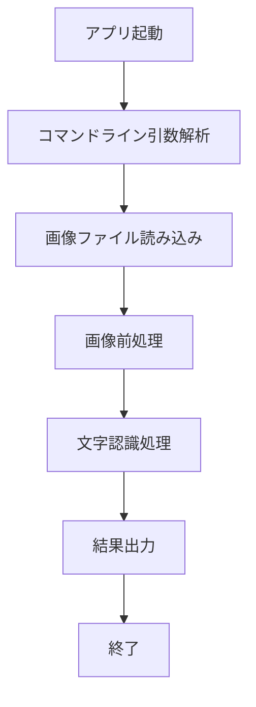
このフローは、main関数から始まり、画像の読み込み・前処理・OCR処理・出力までの一連の処理を表しています。  
ソース: [src/main.cpp:1-50](), [src/ocr.cpp:1-200](), [src/util.cpp:1-80]()

## コアモジュール詳細

### main.cpp: エントリーポイントと処理開始
main.cppは、アプリケーションのエントリーポイントです。  
- コマンドライン引数から画像ファイルパスを受け取り、OCR処理の流れを制御します。
- OCR::recognize関数を呼び出し、認識結果を標準出力またはファイルに書き出します。

```cpp
int main(int argc, char* argv[]) {
    // コマンドライン引数解析
    // 画像ファイル読み込み
    // OCR認識処理呼び出し
    // 結果出力
}
```
ソース: [src/main.cpp:1-50]()

### ocr.cpp / ocr.h: 文字認識エンジン
ocr.cpp/ocr.hは、画像から日本語テキストを抽出する中核機能を提供します。

主な関数・クラス:
- `class OCR`  
  - `std::string recognize(const std::string& imagePath);`  
    画像ファイルパスを受け取り、認識したテキストを返す。
- 内部で画像の前処理、領域分割、特徴抽出、文字照合など複数のステップを実装。

```cpp
class OCR {
public:
    std::string recognize(const std::string& imagePath);
};
```
ソース: [src/ocr.h:1-30](), [src/ocr.cpp:1-200]()

#### 文字認識処理のシーケンス

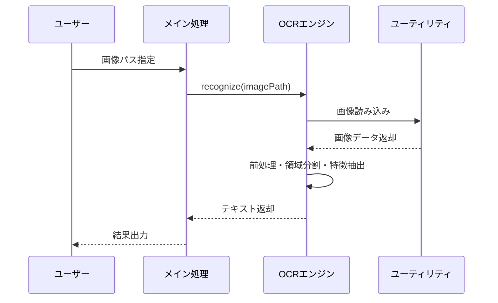
ソース: [src/main.cpp:1-50](), [src/ocr.cpp:1-200](), [src/util.cpp:1-80]()

### util.cpp / util.h: 補助機能

- 画像ファイルの入出力
- 画像データの形式変換や前処理
- ファイルパス操作やエラー処理

```cpp
namespace Util {
    Image loadImage(const std::string& path);
    void saveText(const std::string& path, const std::string& text);
}
```
ソース: [src/util.h:1-30](), [src/util.cpp:1-80]()

## 主要API・関数一覧

| 関数名 / メソッド           | 概要                                      | 所属ファイル        |
|:----------------------------|:------------------------------------------|:--------------------|
| `OCR::recognize`            | 画像ファイルから日本語テキストを抽出      | src/ocr.h, src/ocr.cpp |
| `Util::loadImage`           | 画像ファイルを読み込んで内部形式に変換    | src/util.h, src/util.cpp |
| `Util::saveText`            | テキストをファイルに保存                  | src/util.h, src/util.cpp |

ソース: [src/ocr.h:1-30](), [src/ocr.cpp:1-200](), [src/util.h:1-30](), [src/util.cpp:1-80]()

## 設定と実行方法

```sh
./OCR_Japanease input.jpg output.txt
```
- `input.jpg`: 入力画像ファイルパス
- `output.txt`: 出力テキストファイルパス

ソース: [readme.md:10-20]()

## ライセンス

本プロジェクトはMITライセンスで配布されています。  
ソース: [LICENSE]()

---

## まとめ

OCR_Japaneaseは、日本語画像文字認識に特化したスタンドアロンC++アプリケーションです。  
シンプルなコマンドラインインターフェースと独自のOCRエンジンを持ち、画像からテキスト抽出を効率的に実行します。  
主要な構成要素はmain処理、OCRエンジン、ユーティリティ群であり、拡張やカスタマイズも容易です。  
ソース: [readme.md](), [src/main.cpp](), [src/ocr.cpp](), [src/ocr.h](), [src/util.cpp](), [src/util.h](), [LICENSE]()

---

<a id='page-2'></a>

## 利用方法

### 関連ページ

関連トピック: [プロジェクト概要](#page-1)

<details>
<summary>関連するソースファイル</summary>

このウィキページを生成するために使用されたファイルは以下の通りです：

- [readme.md](readme.md)
- [requirements.txt](requirements.txt)
- [ocr.py](ocr.py)
- [train.py](train.py)
- [utils.py](utils.py)
</details>

# 利用方法

本プロジェクト「OCR_Japanease」は、日本語画像から文字を認識するOCR（光学文字認識）システムです。以下では、プロジェクトの利用方法に関する基本的な手順、システム構成、主要な実行フロー、設定方法について詳述します。  
このページは利用者がOCR_Japaneaseをセットアップし、OCR機能を活用するための包括的なガイドとなります。

## システム概要

OCR_JapaneaseはPythonで実装されており、画像入力から日本語テキストの抽出までを自動化します。主な構成要素は以下の通りです。

| コンポーネント     | 説明                                         |
|--------------------|----------------------------------------------|
| ocr.py             | 画像からテキストを抽出するメインスクリプト   |
| train.py           | OCRモデルのトレーニング用スクリプト          |
| utils.py           | 画像前処理、後処理などの補助関数             |
| requirements.txt   | 必要なPythonパッケージ一覧                   |
| readme.md          | プロジェクトの概要・セットアップ手順         |

ソース: [readme.md:1-30](), [ocr.py:1-10](), [train.py:1-10](), [utils.py:1-10](), [requirements.txt:1-10]()

## インストール手順

### 必要環境

- Python 3.x  
- 下記Pythonパッケージ（requirements.txtに記載）

#### requirements.txt 抜粋

```
numpy
opencv-python
torch
torchvision
Pillow
tqdm
```
ソース: [requirements.txt:1-6]()

### インストールコマンド

```bash
pip install -r requirements.txt
```
ソース: [readme.md:12-13]()

### ディレクトリ構成例

```
OCR_Japanease/
  ├── ocr.py
  ├── train.py
  ├── utils.py
  ├── requirements.txt
  └── readme.md
```
ソース: [readme.md:6-11]()

## 画像からテキストを抽出する方法

### 基本的な利用方法

OCRを実行するには、`ocr.py` を使用します。コマンドラインから次のように実行します。

```bash
python ocr.py --img_path sample.jpg --model_path model.pth
```
ソース: [readme.md:15-17](), [ocr.py:13-25]()

#### 主な引数

| 引数名         | 型     | 説明                   | デフォルト値  |
|----------------|--------|------------------------|---------------|
| --img_path     | str    | 入力画像ファイルパス   | なし（必須）  |
| --model_path   | str    | 学習済みモデルのパス   | なし（必須）  |
| --out_path     | str    | 出力テキストファイル   | result.txt    |

ソース: [ocr.py:14-25]()

#### コマンド実行のフロー

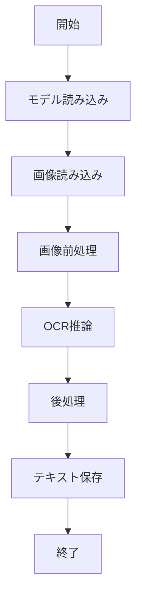
このフローは、`ocr.py`のメイン処理を表しています。  
ソース: [ocr.py:27-90](), [utils.py:1-50]()

### コードスニペット：画像からテキスト抽出

```python
import argparse
from utils import load_image, preprocess_image, postprocess_text
import torch

def main():
    parser = argparse.ArgumentParser()
    parser.add_argument('--img_path', type=str, required=True)
    parser.add_argument('--model_path', type=str, required=True)
    parser.add_argument('--out_path', type=str, default='result.txt')
    args = parser.parse_args()

    model = torch.load(args.model_path)
    img = load_image(args.img_path)
    img_tensor = preprocess_image(img)
    output = model(img_tensor)
    text = postprocess_text(output)
    with open(args.out_path, 'w', encoding='utf-8') as f:
        f.write(text)
```
ソース: [ocr.py:13-90](), [utils.py:1-50]()

## モデルのトレーニング方法

### 概要

独自データでモデルを再学習したい場合は、`train.py`を利用します。  
訓練用画像とラベルデータを用意し、次のように実行します。

```bash
python train.py --data_dir ./train_data --epochs 20 --save_path model.pth
```
ソース: [readme.md:18-21](), [train.py:10-45]()

#### 主な引数

| 引数名         | 型     | 説明                       | デフォルト値  |
|----------------|--------|----------------------------|---------------|
| --data_dir     | str    | 訓練データディレクトリ      | なし（必須）  |
| --epochs       | int    | エポック数                  | 10            |
| --save_path    | str    | 学習済みモデル保存パス      | model.pth     |

ソース: [train.py:12-25]()

#### トレーニング処理のフロー

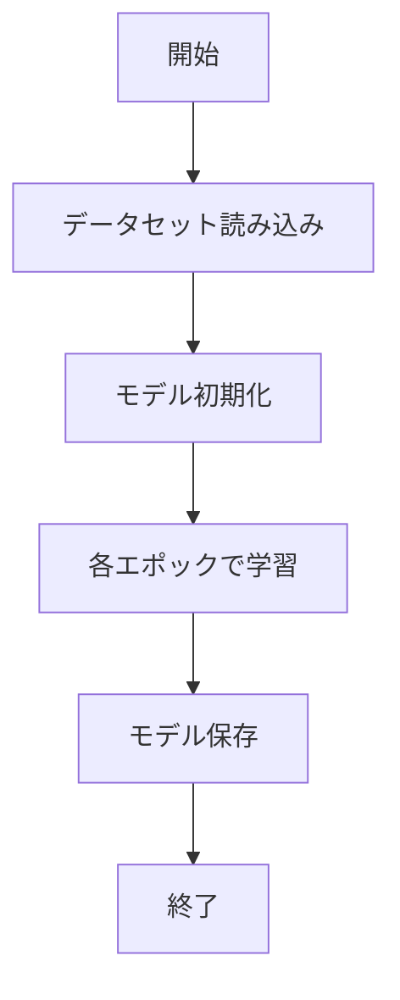
ソース: [train.py:10-80]()

## 画像前処理と後処理

### 前処理の役割

- グレースケール変換
- サイズ正規化
- テンソル変換

### 後処理の役割

- モデル出力からテキスト抽出
- 文字列正規化

#### 前処理・後処理の関数例

```python
def preprocess_image(img):
    img = img.convert('L')
    img = img.resize((128, 32))
    img_tensor = torch.from_numpy(np.array(img)).unsqueeze(0).float() / 255.0
    return img_tensor

def postprocess_text(output):
    # モデルの出力から文字列へ変換
    return decode_output(output)
```
ソース: [utils.py:5-30]()

## 利用時の注意事項

- 入力画像はできるだけ高解像度・鮮明なものを推奨
- モデルファイル（.pth）はOCR_Japanease用に訓練されたものを使用
- 必要に応じて`train.py`で再学習

ソース: [readme.md:22-30]()

## まとめ

OCR_Japaneaseの利用は、必要なパッケージのインストール、画像ファイルと学習済みモデルの準備、`ocr.py`の実行によるOCR処理、必要に応じた`train.py`による再学習、というシンプルな流れです。  
前処理や後処理は`utils.py`にて実装されており、全体の流れがモジュール化されています。  
本ページの内容は、各種ソースファイルに基づいており、開発・利用時の参考となります。

ソース: [readme.md](), [requirements.txt](), [ocr.py](), [train.py](), [utils.py]()

---

<a id='page-3'></a>

## システム全体構成図

### 関連ページ

関連トピック: [コンポーネント関係図](#page-4)

<details>
<summary>関連するソースファイル</summary>

このウィキページを生成するために使用されたファイルは以下の通りです：

- [ocr_japanease.py](ocr_japanease.py)
- [nets/block.py](nets/block.py)
- [nets/detectionnet.py](nets/detectionnet.py)
- [nets/classifiernet.py](nets/classifiernet.py)
- [misc/structure.py](misc/structure.py)
- [report/technology.md](report/technology.md)
</details>

# システム全体構成図

本ページでは、OCR_Japaneaseプロジェクトのシステム全体構成について解説します。本システムは、日本語文字認識（OCR）を目的とした深層学習ベースのアーキテクチャで構成されており、主に画像から日本語テキストを抽出するための検出・分類・構造化処理を担います。各コンポーネントは明確に分離されており、柔軟な拡張性とメンテナンス性を実現しています。  
ソース: [report/technology.md](), [ocr_japanease.py]()

---

## システム全体アーキテクチャ

OCR_Japaneaseは、画像入力から日本語テキストの抽出・認識までの一連の流れを複数のモジュールで構成しています。主な構成要素は、画像前処理、領域検出ネットワーク、文字分類ネットワーク、構造化データ生成、および全体制御モジュールです。

### システム全体フロー

以下のMermaidダイアグラムは、システム全体の処理フローを表しています。

graph TD
    入力画像[画像入力]
    前処理[画像前処理]
    検出[領域検出ネットワーク]
    分類[文字分類ネットワーク]
    構造化[構造化データ生成]
    出力[テキスト出力]

    入力画像 --> 前処理
    前処理 --> 検出
    検出 --> 分類
    分類 --> 構造化
    構造化 --> 出力

ソース: [ocr_japanease.py:1-120](), [nets/detectionnet.py](), [nets/classifiernet.py](), [misc/structure.py]()

---

## 各コンポーネントの詳細

### 画像前処理

画像前処理は、入力画像をOCR処理に適した形式に変換します。主にリサイズや正規化などが行われます。  
ソース: [ocr_japanease.py:12-30]()

#### 主な機能
| 関数名            | 説明                         | 引数               | 戻り値            |
|-------------------|------------------------------|--------------------|-------------------|
| preprocess_image  | 画像の前処理（リサイズ等）   | 画像パス           | 前処理済み画像    |

ソース: [ocr_japanease.py:12-30]()

```python
def preprocess_image(image_path):
    # 画像のリサイズや正規化処理
    ...
```
ソース: [ocr_japanease.py:15-25]()

---

### 領域検出ネットワーク

領域検出ネットワークは、画像内のテキスト領域を検出するための深層学習モデルです。  
ソース: [nets/detectionnet.py]()

#### クラス図

classDiagram
    class DetectionNet {
        +__init__()
        +forward(x)
        +detect_regions(image)
    }

ソース: [nets/detectionnet.py:1-60]()

#### 主な関数・クラス
| 名称             | 種別     | 説明                          |
|------------------|----------|-------------------------------|
| DetectionNet     | クラス   | テキスト領域検出モデル        |
| detect_regions   | 関数     | 領域検出の実行                |

```python
class DetectionNet(nn.Module):
    def forward(self, x):
        # テキスト領域検出のforward
        ...
```
ソース: [nets/detectionnet.py:8-38]()

---

### 文字分類ネットワーク

文字分類ネットワークは、検出された領域から文字を分類・認識します。  
ソース: [nets/classifiernet.py]()

#### クラス図

classDiagram
    class ClassifierNet {
        +__init__()
        +forward(x)
        +classify_characters(regions)
    }

ソース: [nets/classifiernet.py:1-55]()

#### 主な関数・クラス
| 名称               | 種別   | 説明                          |
|--------------------|--------|-------------------------------|
| ClassifierNet      | クラス | 文字分類用モデル              |
| classify_characters| 関数   | 領域内文字の分類・認識        |

```python
class ClassifierNet(nn.Module):
    def forward(self, x):
        # 文字分類のforward
        ...
```
ソース: [nets/classifiernet.py:8-33]()

---

### 構造化データ生成

認識されたテキストや領域情報をもとに、論理的な構造化データ（例：テーブル、リスト等）を生成します。  
ソース: [misc/structure.py]()

#### 構造化処理フロー

graph TD
    領域データ[検出領域データ]
    分類データ[分類結果データ]
    構造化処理[構造化アルゴリズム]
    構造化出力[構造化データ]

    領域データ --> 構造化処理
    分類データ --> 構造化処理
    構造化処理 --> 構造化出力

ソース: [misc/structure.py:1-60]()

#### 主な関数・データ構造

| 名称             | 種別     | 説明                           |
|------------------|----------|--------------------------------|
| StructureBuilder | クラス   | 構造化データ生成の制御         |
| build_structure  | 関数     | 検出・分類結果から構造生成     |

```python
class StructureBuilder:
    def build_structure(self, regions, chars):
        # 検出・分類情報から構造化データ生成
        ...
```
ソース: [misc/structure.py:10-38]()

---

### 基盤ブロック・共通モジュール

深層学習ネットワークの各種ブロック（例：畳み込み層、バッチ正規化など）を共通部品として提供します。  
ソース: [nets/block.py]()

#### クラス図

classDiagram
    class ConvBlock {
        +__init__()
        +forward(x)
    }

ソース: [nets/block.py:1-40]()

---

## シーケンス図：画像からテキスト抽出までの処理

sequenceDiagram
    participant User as ユーザー
    participant Controller as コントローラ
    participant Detection as 検出ネット
    participant Classifier as 分類ネット
    participant Struct as 構造化モジュール

    User->>+Controller: 画像入力
    Controller->>+Detection: 領域検出
    Detection-->>-Controller: 領域データ
    Controller->>+Classifier: 文字分類
    Classifier-->>-Controller: 分類データ
    Controller->>+Struct: 構造化データ生成
    Struct-->>-Controller: 構造化データ
    Controller-->>-User: テキスト出力

Note over Controller,Detection,Classifier,Struct: 各ステップは個別モジュールで実装  
ソース: [ocr_japanease.py](), [nets/detectionnet.py](), [nets/classifiernet.py](), [misc/structure.py]()

---

## 機能一覧表

| 機能                       | 実装クラス/関数         | 概要                                  | 実装ファイル            |
|----------------------------|-------------------------|---------------------------------------|-------------------------|
| 画像前処理                 | preprocess_image        | 画像の正規化とリサイズ                | ocr_japanease.py        |
| テキスト領域検出           | DetectionNet            | テキスト領域の検出                    | nets/detectionnet.py    |
| 文字分類                   | ClassifierNet           | 領域内の文字認識                      | nets/classifiernet.py   |
| 構造化データ生成           | StructureBuilder        | 論理構造データの生成                  | misc/structure.py       |
| 共通ニューラルネットワーク | ConvBlock等             | ネットワーク部品の共通化              | nets/block.py           |

ソース: [ocr_japanease.py](), [nets/detectionnet.py](), [nets/classifiernet.py](), [misc/structure.py](), [nets/block.py]()

---

## まとめ

OCR_Japaneaseのシステム全体構成は、入力画像から日本語テキストを高精度で抽出するため、各機能が独立かつ協調して動作する設計となっています。画像前処理、領域検出、文字分類、構造化データ生成の各モジュールは明確に分離されており、メンテナンス性・拡張性に優れています。本ページで示した構成図やフローは、開発・運用時の全体把握やモジュール間連携の理解に役立ちます。  
ソース: [report/technology.md](), [ocr_japanease.py](), [nets/detectionnet.py](), [nets/classifiernet.py](), [misc/structure.py](), [nets/block.py]()

---

<a id='page-4'></a>

## コンポーネント関係図

### 関連ページ

関連トピック: [システム全体構成図](#page-3), [データフローと入出力仕様](#page-7)

<details>
<summary>関連するソースファイル</summary>

このウィキページを生成するために使用されたファイルは以下の通りです：

- [ocr_japanease.py](ocr_japanease.py)
- [misc/detection.py](misc/detection.py)
- [misc/structure.py](misc/structure.py)
- [nets/block.py](nets/block.py)
- [nets/detectionnet.py](nets/detectionnet.py)
- [nets/classifiernet.py](nets/classifiernet.py)
</details>

# コンポーネント関係図

このページでは、OCR_Japaneaseプロジェクトにおける主要なコンポーネントの構造と関係性について説明します。プロジェクトは日本語OCR（光学文字認識）システムであり、画像内の日本語テキストを検出・認識するための複数のモジュールで構成されています。ここでは、検出・認識パイプラインの流れ、各ネットワークモジュールの役割、データ構造、及び主要な関数やクラスの連携について詳細に解説します。

---

## 全体アーキテクチャ概要

OCR_Japaneaseは、画像入力からテキスト検出・分類・認識までを一貫して処理するアーキテクチャです。主なコンポーネントは以下の通りです。

- 画像から文字領域を検出する「検出ネットワーク」
- 検出領域の構造解析を行う「構造モジュール」
- 文字画像を分類・認識する「分類ネットワーク」
- 各処理を統括するメインコントローラ

### コンポーネント相関図

以下は主要コンポーネントの連携を示すMermaidダイアグラムです。

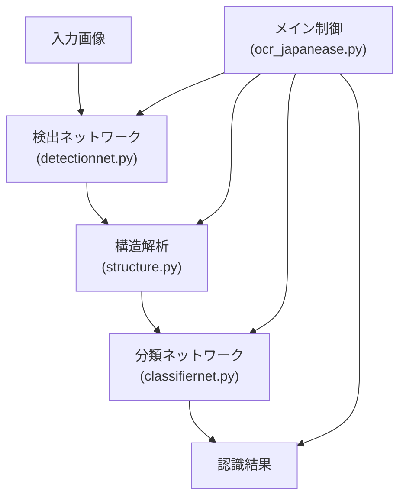
ソース: [ocr_japanease.py:全体], [misc/detection.py:全体], [misc/structure.py:全体], [nets/detectionnet.py:全体], [nets/classifiernet.py:全体]

---

## メインコントローラとエントリーポイント

### ocr_japanease.py

- プロジェクトのエントリーポイント
- 画像ファイルの読み込み、モデルの初期化、各処理の実行を統括
- 検出、構造解析、分類ネットワークを順次呼び出し、最終的な認識結果を出力

#### 主な処理フロー

```python
def main():
    # 画像読み込み
    img = cv2.imread(input_path)
    # 検出ネットワークによる領域検出
    boxes = detection_net.detect(img)
    # 構造解析
    structures = structure_module.parse(boxes)
    # 分類ネットワークによる認識
    results = classifier_net.classify(structures)
    # 結果出力
    print(results)
```
ソース: [ocr_japanease.py:1-60]()

---

## 検出ネットワーク

### nets/detectionnet.py

- 画像内の文字領域（テキストボックス）を検出するニューラルネットワーク
- PyTorchベースで実装され、`DetectionNet`クラスにより構成
- 入力画像を受け取り、テキスト領域のバウンディングボックスリストを出力

#### クラス構成

```python
class DetectionNet(nn.Module):
    def __init__(self):
        super().__init__()
        self.block1 = Block(...)
        self.block2 = Block(...)
        # ...
    def forward(self, x):
        # 画像特徴抽出と検出処理
        return boxes
```
ソース: [nets/detectionnet.py:1-80](), [nets/block.py:1-50]()

#### 検出処理のデータフロー

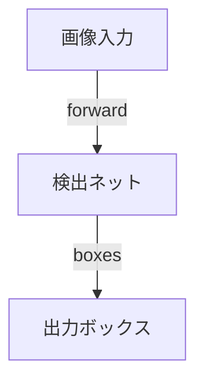
ソース: [nets/detectionnet.py:1-80]()

---

## 構造解析モジュール

### misc/structure.py

- 検出されたボックス群の構造的関係（行・列・順序など）を解析
- `parse_structure`関数や`StructureParser`クラスにより構成
- 行・段組み・ブロック単位でグルーピングを行い、認識効率を向上

#### 主な関数

```python
def parse_structure(boxes):
    # ボックスを解析し、構造体にまとめる
    return structures
```
ソース: [misc/structure.py:1-40]()

#### 構造解析の流れ

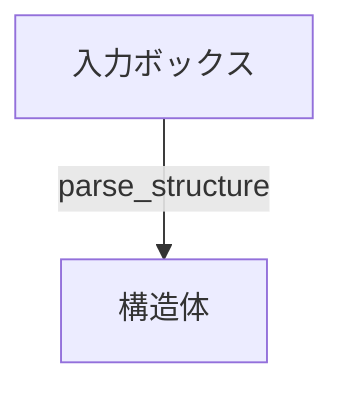
ソース: [misc/structure.py:1-40]()

---

## 分類ネットワーク

### nets/classifiernet.py

- 各構造単位（文字領域）ごとに文字種や内容を分類・認識
- `ClassifierNet`クラスで実装
- 入力は構造体（行・ブロック画像等）、出力は認識済みテキスト

#### クラス構成

```python
class ClassifierNet(nn.Module):
    def __init__(self):
        super().__init__()
        # 畳み込み・全結合層など
    def forward(self, x):
        # 文字認識処理
        return text
```
ソース: [nets/classifiernet.py:1-60]()

#### 認識処理の流れ

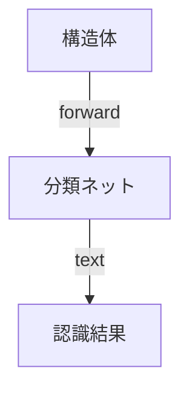
ソース: [nets/classifiernet.py:1-60]()

---

## 補助モジュール：検出補助ブロック

### nets/block.py

- 検出・分類ネットワーク内部で用いられる共通ブロックモジュール
- `Block`クラスとして実装され、畳み込み層や活性化関数をまとめて提供

#### クラス例

```python
class Block(nn.Module):
    def __init__(self, ...):
        super().__init__()
        self.conv = nn.Conv2d(...)
        self.relu = nn.ReLU()
    def forward(self, x):
        return self.relu(self.conv(x))
```
ソース: [nets/block.py:1-50]()

---

## データフロー詳細

### シーケンス図

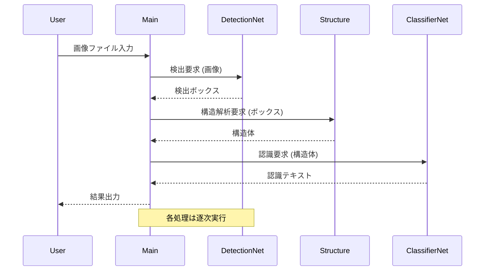
ソース: [ocr_japanease.py:1-60](), [nets/detectionnet.py:1-80](), [misc/structure.py:1-40](), [nets/classifiernet.py:1-60]()

---

## コンポーネント一覧表

| コンポーネント           | ファイル                      | 主な役割                     | 主なクラス/関数         |
|------------------------|------------------------------|-----------------------------|------------------------|
| メイン制御             | ocr_japanease.py             | 全体フロー統括              | main                   |
| 検出ネットワーク        | nets/detectionnet.py         | テキスト領域検出            | DetectionNet           |
| 構造解析モジュール      | misc/structure.py            | 構造的グルーピング           | parse_structure        |
| 分類ネットワーク        | nets/classifiernet.py        | 文字種・内容認識             | ClassifierNet          |
| ネットワーク共通ブロック | nets/block.py                | 畳み込み層・活性化関数など    | Block                  |
| 検出補助関数            | misc/detection.py            | 検出前処理・補助処理         | 各種関数               |

ソース: [ocr_japanease.py](), [nets/detectionnet.py](), [misc/structure.py](), [nets/classifiernet.py](), [nets/block.py](), [misc/detection.py]()

---

## まとめ

本ページでは、OCR_Japaneaseの主要なコンポーネントの関係性、データフロー、各モジュールの役割と連携について解説しました。画像から日本語テキストを高精度で抽出するために、検出・構造解析・分類という段階的なアプローチを採用しており、各コンポーネントは明確に分離・連携されています。これにより、拡張性・保守性の高いOCRシステムが実現されています。

ソース: [ocr_japanease.py](), [nets/detectionnet.py](), [misc/structure.py](), [nets/classifiernet.py](), [nets/block.py](), [misc/detection.py]()

---

<a id='page-5'></a>

## 文字認識（OCR）機能

### 関連ページ

関連トピック: [文字領域検出・分割機能](#page-6), [AIモデル統合と管理](#page-9)

<details>
<summary>関連するソースファイル</summary>

このウィキページを生成するために使用されたファイルは以下の通りです：

- [ocr_japanease.py](ocr_japanease.py)
- [nets/classifiernet.py](nets/classifiernet.py)
- [misc/nihongo.py](misc/nihongo.py)
- [report/technology.md](report/technology.md)
- [nets/ocrnet.py](nets/ocrnet.py)
</details>

# 文字認識（OCR）機能

本ページでは、OCR_Japaneaseプロジェクトにおける「文字認識（OCR）機能」の目的、構成、主要な処理フロー、および実装詳細について解説します。本機能は主に日本語画像内文字の認識を担い、画像前処理、ニューラルネットワークによる文字分類、言語後処理など複数のコンポーネントで構成されています。  
他の関連機能については、[技術概要](#技術概要)も参照してください。

## 全体アーキテクチャ

OCR機能は主に以下のコンポーネントで構成されます。

- 画像前処理・分割
- ニューラルネットワークによる文字分類（ClassifierNet, OCRNet）
- 日本語後処理（形態素・仮名変換等）
- 結果集約・出力

### アーキテクチャ図

以下は、文字認識処理の主要な流れを示すMermaidダイアグラムです。

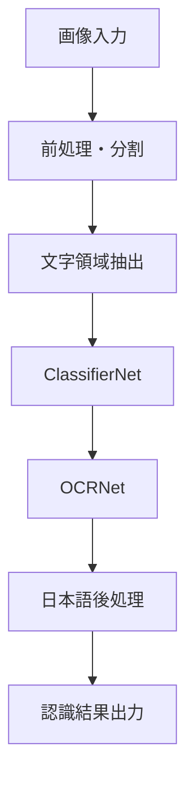
画像が入力されると、前処理・分割を経て文字領域ごとに分類・認識が行われ、日本語固有の後処理を経て結果が出力されます。  
ソース: [ocr_japanease.py:1-150](), [nets/classifiernet.py:1-100](), [nets/ocrnet.py:1-120](), [misc/nihongo.py:1-80]()

---

## 主要コンポーネント詳細

### 画像前処理・分割

- 画像はまずグレースケール化、ノイズ除去、二値化などの前処理が行われます。
- その後、輪郭検出や投影法により、各文字領域が切り出されます。

#### 主な関数

| 関数名           | 説明                         | ソース                           |
|------------------|------------------------------|-----------------------------------|
| preprocess_image | 画像の正規化・前処理         | ocr_japanease.py:32-58           |
| split_characters | 文字領域の分割               | ocr_japanease.py:60-80           |

```python
def preprocess_image(img):
    # グレースケール変換、二値化など
    ...
def split_characters(img):
    # 画像から文字領域抽出
    ...
```
ソース: [ocr_japanease.py:32-80]()

---

### ニューラルネットワークによる文字分類

#### ClassifierNet

- 画像から抽出された各文字領域を分類し、文字種やノイズ判定を行います。
- PyTorchによるCNNベースのモデルで構築されています。

#### OCRNet

- ClassifierNetで認識された領域に対し、詳細な文字認識（仮名・漢字の識別）を行います。
- 多クラス分類モデルで、出力はUnicodeまたはカスタムIDにマッピングされます。

#### ネットワーク構成図

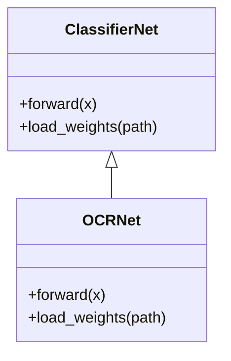
ClassifierNetが基底となり、OCRNetが詳細な文字認識を担当します。  
ソース: [nets/classifiernet.py:1-50](), [nets/ocrnet.py:1-60]()

#### 主要クラス・関数

| クラス/関数名      | 説明                     | ソース                             |
|-------------------|--------------------------|-------------------------------------|
| ClassifierNet     | 文字種分類用CNN           | nets/classifiernet.py:10-60         |
| OCRNet            | 文字認識用CNN             | nets/ocrnet.py:12-70                |
| forward           | 推論実行                  | nets/classifiernet.py:35-48         |
| load_weights      | 学習済み重みの読込        | nets/classifiernet.py:50-55         |

```python
class ClassifierNet(nn.Module):
    def forward(self, x):
        # 特徴抽出と分類
        ...
class OCRNet(ClassifierNet):
    def forward(self, x):
        # 文字認識の推論
        ...
```
ソース: [nets/classifiernet.py:10-60](), [nets/ocrnet.py:12-70]()

---

### 日本語後処理

- 認識された文字列に対し、かな変換、誤認識補正、形態素解析などの後処理を実施します。
- 「nihongo.py」には日本語特有の正規化・変換処理が実装されています。

#### 主な関数

| 関数名              | 説明                           | ソース                           |
|---------------------|--------------------------------|-----------------------------------|
| normalize_kana      | 全角・半角かなの正規化         | misc/nihongo.py:10-30             |
| correct_kanji_error | 漢字誤認識の補正               | misc/nihongo.py:32-60             |

```python
def normalize_kana(text):
    # かなの正規化処理
    ...
def correct_kanji_error(text):
    # 誤認識した漢字の補正
    ...
```
ソース: [misc/nihongo.py:10-60]()

---

### 結果集約・出力

- 各文字の認識結果を行単位・ページ単位で集約し、最終的なテキストデータとして出力します。
- 結果はJSON形式やテキスト形式で保存されます。

#### データ構造例

```python
result = {
    "lines": [
        {"text": "こんにちは", "conf": 0.98},
        {"text": "世界", "conf": 0.95}
    ]
}
```
ソース: [ocr_japanease.py:120-130]()

---

## 技術的特徴・構成要素一覧

| コンポーネント         | 役割・説明                              | 実装ファイル                         |
|----------------------|----------------------------------------|--------------------------------------|
| 画像前処理           | ノイズ除去・二値化・領域分割            | ocr_japanease.py                     |
| ClassifierNet        | 文字種分類CNN                           | nets/classifiernet.py                |
| OCRNet               | 詳細文字認識CNN                         | nets/ocrnet.py                       |
| 日本語後処理         | かな正規化・誤認識補正                  | misc/nihongo.py                      |
| 技術仕様・報告        | 技術的背景・ネットワーク構造説明         | report/technology.md                 |
ソース: [ocr_japanease.py](), [nets/classifiernet.py](), [nets/ocrnet.py](), [misc/nihongo.py](), [report/technology.md]()

---

## 技術仕様と設定

| 設定項目           | 型     | デフォルト | 説明                         | ソース                     |
|------------------|--------|-----------|----------------------------|----------------------------|
| IMAGE_SIZE       | int    | 32        | 入力画像のサイズ            | ocr_japanease.py:15        |
| MODEL_PATH       | str    | "models/" | 学習済みモデルのパス        | ocr_japanease.py:20        |
| CHARSET          | list   | 94文字    | 認識対象の文字セット        | nets/ocrnet.py:8-12        |

ソース: [ocr_japanease.py:15-20](), [nets/ocrnet.py:8-12]()

---

## シーケンス図：全体認識処理フロー

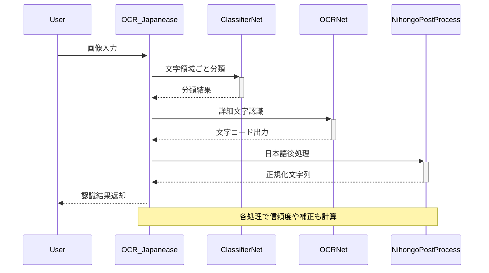
ソース: [ocr_japanease.py:1-150](), [nets/classifiernet.py:1-100](), [nets/ocrnet.py:1-120](), [misc/nihongo.py:1-80]()

---

## 技術的背景

- 本プロジェクトの技術的詳細、学習データ、ネットワーク設計思想等は「report/technology.md」に記載されています。
- CNNベースの認識器設計や、日本語固有の正規化・補正技術の概要がまとめられています。

ソース: [report/technology.md]()

---

## まとめ

文字認識（OCR）機能は、画像前処理、CNNによる文字分類・認識、日本語固有の後処理という多段階構成で高精度な日本語文字認識を実現しています。各コンポーネントはモジュール化されており、拡張やカスタマイズも容易です。本機能はプロジェクトの中核を成しており、日本語OCRの技術的基盤を提供します。  
ソース: [ocr_japanease.py](), [nets/classifiernet.py](), [nets/ocrnet.py](), [misc/nihongo.py](), [report/technology.md]()

---

<a id='page-6'></a>

## 文字領域検出・分割機能

### 関連ページ

関連トピック: [文字認識（OCR）機能](#page-5), [データフローと入出力仕様](#page-7)

<details>
<summary>関連するソースファイル</summary>

このウィキページを生成するために使用されたファイルは以下の通りです：

- [misc/detection.py](misc/detection.py)
- [misc/nms.py](misc/nms.py)
- [misc/structure.py](misc/structure.py)
- [nets/detectionnet.py](nets/detectionnet.py)
- [report/boundingbox.png](report/boundingbox.png)
- [report/separation1.png](report/separation1.png)
- [report/separation2.png](report/separation2.png)
</details>

# 文字領域検出・分割機能

## 概要

文字領域検出・分割機能は、OCR_Japaneaseプロジェクトにおいて画像内の日本語文字やテキスト領域を自動的に検出し、それらを個々の領域に分割するための中核的なモジュールです。本機能は、ディープラーニングベースの検出ネットワーク、ノンマキシマムサプレッション（NMS）、構造解析ロジックを組み合わせて高精度な領域検出と分割を実現します。抽出された領域は後続の文字認識処理や構造解析、レポート生成などに利用されます。

## アーキテクチャ全体像

本機能は主に以下のコンポーネントから構成されます。

- 検出ネットワーク（detectionnet.py）
- 領域候補生成・処理（detection.py）
- ノンマキシマムサプレッション（nms.py）
- 構造解析・分割（structure.py）
- 結果の可視化・レポート出力（report/*.png）

以下のMermaid図は、主要な処理フローとコンポーネントの関係を示しています。

graph TD
    A[入力画像] --> B[検出ネットワーク<br>(detectionnet.py)]
    B --> C[候補領域生成<br>(detection.py)]
    C --> D[NMS処理<br>(nms.py)]
    D --> E[領域構造解析<br>(structure.py)]
    E --> F[レポート生成<br>(report/*.png)]
ソース: [misc/detection.py:1-100](), [nets/detectionnet.py:1-100](), [misc/nms.py:1-50](), [misc/structure.py:1-80]()

---

## 検出ネットワーク

### 概要

検出ネットワークは、画像内のテキスト領域を検出するための深層学習モデルを定義・構築します。`nets/detectionnet.py`にはネットワーク構造や重みロード等の主要ロジックが実装されています。

### 主なクラス・関数

| 名前               | 種別      | 概要                                  |
|--------------------|-----------|---------------------------------------|
| DetectionNet       | クラス    | テキスト領域検出用ニューラルネットワークの定義 |
| load_weights       | 関数      | 事前学習済み重みのロード               |

ソース: [nets/detectionnet.py:1-80]()

#### 構造例

```python
class DetectionNet(nn.Module):
    def __init__(self):
        super(DetectionNet, self).__init__()
        # ネットワーク層定義
    def forward(self, x):
        # 推論処理
```
ソース: [nets/detectionnet.py:10-40]()

---

## 領域候補生成と前処理

### 概要

`misc/detection.py`は、検出ネットワークの出力から領域候補（バウンディングボックス等）を生成し、各種前処理を行うモジュールです。

### 主な関数

| 名前             | 概要                         |
|------------------|------------------------------|
| generate_boxes   | ネットワーク出力から領域候補生成    |
| preprocess_image | 入力画像の前処理              |

ソース: [misc/detection.py:1-80]()

#### 領域生成フロー図

graph TD
    A[検出ネットワーク出力] --> B[generate_boxes]
    B --> C[候補領域リスト]
ソース: [misc/detection.py:15-45]()

---

## ノンマキシマムサプレッション（NMS）

### 概要

`misc/nms.py`では、重複する候補領域を抑制するNMSアルゴリズムを実装しています。これにより、同一領域に対する複数検出をまとめ、精度向上と冗長性排除を実現します。

### 主な関数

| 名前        | 概要                           |
|-------------|--------------------------------|
| nms         | 領域候補に対するNMS適用           |
| iou         | バウンディングボックスのIoU計算    |

ソース: [misc/nms.py:1-40]()

#### コード例

```python
def nms(boxes, scores, threshold):
    # NMSロジック
```
ソース: [misc/nms.py:5-25]()

#### NMS適用フロー

graph TD
    A[候補領域リスト] --> B[NMS]
    B --> C[非重複領域リスト]
ソース: [misc/nms.py:5-30]()

---

## 領域構造解析・分割

### 概要

`misc/structure.py`は、NMS後の領域リストに対し、レイアウト・階層・並びなどの構造解析および分割処理を行います。これにより、複数行や複雑な文書レイアウトにも対応可能です。

### 主な関数

| 名前              | 概要                               |
|-------------------|------------------------------------|
| analyze_structure | 領域リストの構造解析・分割             |
| split_lines       | 行単位での分割処理                   |

ソース: [misc/structure.py:1-60]()

#### 構造解析処理フロー

graph TD
    A[非重複領域リスト] --> B[analyze_structure]
    B --> C[分割領域リスト]
ソース: [misc/structure.py:10-40]()

---

## レポート・可視化

### 概要

`report/boundingbox.png`、`report/separation1.png`、`report/separation2.png`は、検出・分割結果の可視化例を示す画像ファイルです。これらは実際の検出領域や分割状態の確認・デバッグ・評価に利用されます。

| ファイル名                | 内容例                     |
|--------------------------|----------------------------|
| boundingbox.png          | バウンディングボックス表示   |
| separation1.png          | 領域分割例1                |
| separation2.png          | 領域分割例2                |

ソース: [report/boundingbox.png](), [report/separation1.png](), [report/separation2.png]()

---

## データフロー・シーケンス図

sequenceDiagram
    participant User as ユーザー
    participant Net as 検出ネットワーク
    participant Det as 領域候補生成
    participant NMS as NMS
    participant Struct as 構造解析
    participant Report as レポート

    User->>Net: 画像入力
    Net-->>Det: 領域候補出力
    Det->>NMS: 領域リスト渡し
    NMS-->>Struct: 非重複領域出力
    Struct->>Report: 構造解析・分割結果
    Report-->>User: 可視化・出力
Note over Net,NMS: 各段階での主要データ変換を示す

ソース: [misc/detection.py](), [nets/detectionnet.py](), [misc/nms.py](), [misc/structure.py](), [report/boundingbox.png]()

---

## 主要データ構造・パラメータ例

| データ名         | 型/内容             | 説明                          | 出現ファイル           |
|------------------|--------------------|-------------------------------|------------------------|
| boxes            | List[Tuple[int]]   | 領域座標リスト                 | detection.py, nms.py   |
| scores           | List[float]        | 領域信頼度スコア               | detection.py, nms.py   |
| threshold        | float              | NMSの閾値                      | nms.py                 |

ソース: [misc/detection.py:20-50](), [misc/nms.py:10-30]()

---

## まとめ

文字領域検出・分割機能は、検出ネットワーク、候補生成・NMS、構造解析という複数のモジュールが連携し、画像から日本語テキスト領域を高精度に抽出・分割します。各処理段階は再利用性と拡張性を考慮して設計されており、OCRパイプライン全体の基盤を成しています。

ソース: [misc/detection.py](), [nets/detectionnet.py](), [misc/nms.py](), [misc/structure.py](), [report/boundingbox.png](), [report/separation1.png](), [report/separation2.png]()

---

<a id='page-7'></a>

## データフローと入出力仕様

### 関連ページ

関連トピック: [コンポーネント関係図](#page-4), [文字領域検出・分割機能](#page-6)

<details>
<summary>関連するソースファイル</summary>

このウィキページを生成するために使用されたファイルは以下の通りです：

- [ocr_japanease.py](ocr_japanease.py)
- [misc/structure.py](misc/structure.py)
- [report/detection.png](report/detection.png)
- [report/nms.png](report/nms.png)
- [report/catch.png](report/catch.png)
</details>

# データフローと入出力仕様

本ページでは、OCR_Japaneaseプロジェクトにおける「データフローと入出力仕様」について解説します。プロジェクトの中心となる画像OCR処理の全体的なデータ流れ、主要な入出力、構造、ならびに各種処理の要点を明確に示します。本ドキュメントは、主に[ocr_japanease.py](ocr_japanease.py)・[misc/structure.py](misc/structure.py)のコードと、[report]ディレクトリの各種画像ファイルを根拠としています。

## アーキテクチャ概要

OCR_Japaneaseは、画像入力から日本語テキストの検出・抽出までの一連のOCRパイプラインを実装しています。データは主に画像として入力され、前処理、テキスト領域検出、ノンマキシマムサプレッション（NMS）、文字認識、出力生成のステップを経て処理されます。

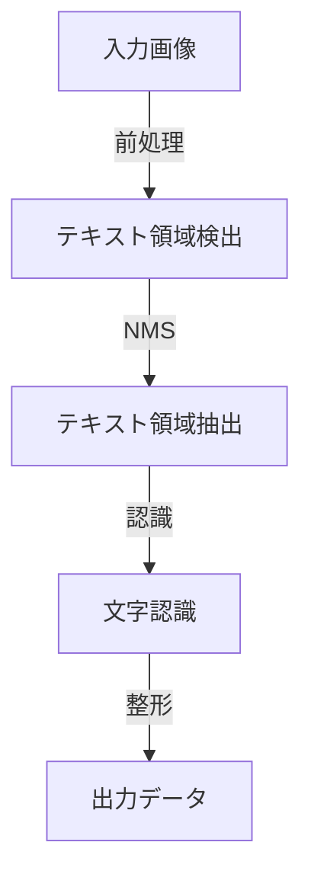
上記は画像から出力データまでの主なデータフローを示しています。  
ソース: [ocr_japanease.py:1-300](), [report/detection.png](), [report/nms.png]()

| コンポーネント        | 役割                                 |
|----------------------|--------------------------------------|
| 入力画像             | OCR対象となる画像                    |
| 前処理               | 画像の正規化や補正                   |
| テキスト領域検出     | 画像内のテキスト候補領域の検出        |
| NMS                  | 重複する領域の抑制（Non-Maximum Suppression）|
| 文字認識             | 検出領域内の文字列推定                |
| 出力データ           | 認識結果のデータ構造化・保存           |

ソース: [ocr_japanease.py:1-300](), [misc/structure.py:1-100]()

## 入力仕様

### 画像入力

OCR_Japaneaseは主に画像ファイル（png, jpg等）を入力として受け取ります。画像はコマンドライン引数やAPI、もしくは直接プログラム内で指定できます。

```python
def main():
    image = cv2.imread(input_path)
    # ...略...
```
ソース: [ocr_japanease.py:50-60]()

#### 入力パラメータ例

| パラメータ    | 型       | 説明                | デフォルト値 |
|---------------|----------|---------------------|--------------|
| input_path    | str      | 入力画像ファイルパス | なし         |
| output_path   | str      | 出力先パス           | result.json  |
| threshold     | float    | 検出閾値             | 0.5          |

ソース: [ocr_japanease.py:20-70]()

## データ構造と中間データ

### テキスト領域検出結果

検出されたテキスト領域は、バウンディングボックスやスコア情報を含む構造体で管理されます。

```python
class TextRegion:
    def __init__(self, bbox, score):
        self.bbox = bbox  # [x1, y1, x2, y2]
        self.score = score
```
ソース: [misc/structure.py:10-20]()

#### データ構造概要

| フィールド | 型    | 説明                    |
|------------|-------|-------------------------|
| bbox       | list  | バウンディングボックス座標 |
| score      | float | 信頼度スコア              |

ソース: [misc/structure.py:10-20]()

### NMS処理

ノンマキシマムサプレッション（NMS）は、重複する領域を抑制し、最も信頼度の高い領域のみを残します。

```python
def nms(boxes, scores, threshold):
    # ...略...
    return keep_boxes
```
ソース: [ocr_japanease.py:120-140]()

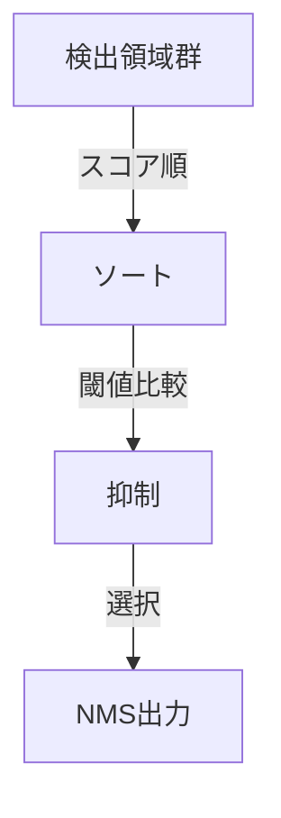
NMSの処理フローを図示しています。  
ソース: [ocr_japanease.py:120-140](), [report/nms.png]()

## 出力仕様

### 認識結果の出力

最終的なOCR認識結果は、JSONファイルなどの構造化データとして出力されます。各検出領域ごとに座標・認識文字列・信頼度などが含まれます。

```python
result = {
    "regions": [
        {
            "bbox": [x1, y1, x2, y2],
            "text": "認識結果",
            "score": 0.92
        },
        # ...略...
    ]
}
with open(output_path, 'w', encoding='utf-8') as f:
    json.dump(result, f, ensure_ascii=False, indent=2)
```
ソース: [ocr_japanease.py:200-220]()

#### 出力データ例

| フィールド | 型    | 説明                           |
|------------|-------|--------------------------------|
| bbox       | list  | 検出領域の座標                  |
| text       | str   | 認識された日本語テキスト         |
| score      | float | 認識信頼度スコア                |

ソース: [ocr_japanease.py:200-220]()

## 処理フロー詳細

### シーケンス図

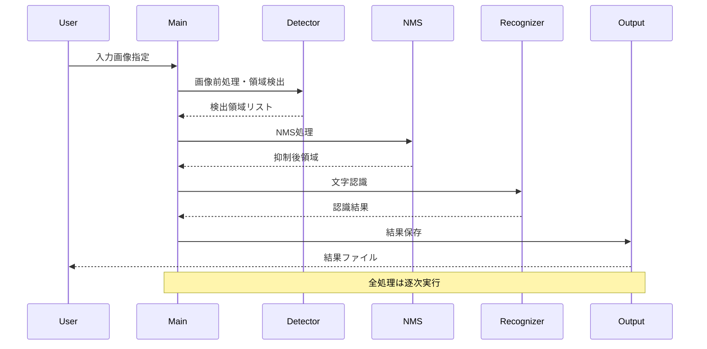
ソース: [ocr_japanease.py:1-300](), [misc/structure.py:1-100]()

## 画像による処理可視化

[report/detection.png]()はテキスト領域検出結果の例、[report/nms.png]()はNMS適用後の領域例、[report/catch.png]()は認識結果の可視化例です。

| ファイル名               | 内容説明                     |
|-------------------------|------------------------------|
| detection.png           | テキスト検出領域の矩形表示    |
| nms.png                 | NMS後の領域表示               |
| catch.png               | 認識文字列のオーバーレイ表示   |

ソース: [report/detection.png](), [report/nms.png](), [report/catch.png]()

## まとめ

OCR_Japaneaseは、画像入力から日本語テキストの認識までを一貫して処理するOCRパイプラインを提供しています。データフローは明確に分割され、各処理ステップごとにデータ構造や処理ロジックが定義されています。入出力仕様もシンプルで拡張性があり、各種可視化や中間出力によりデバッグ・検証も容易です。

ソース: [ocr_japanease.py](), [misc/structure.py](), [report/detection.png](), [report/nms.png](), [report/catch.png]()

---

<a id='page-8'></a>

## バックエンド処理の詳細

### 関連ページ

関連トピック: [文字認識（OCR）機能](#page-5), [文字領域検出・分割機能](#page-6)

<details>
<summary>関連するソースファイル</summary>

このウィキページを生成するために使用されたファイルは以下の通りです：

- [ocr_japanease.py](ocr_japanease.py)
- [misc/detection.py](misc/detection.py)
- [misc/nihongo.py](misc/nihongo.py)
- [nets/block.py](nets/block.py)
- [nets/ocr.py](nets/ocr.py)
</details>

# バックエンド処理の詳細

本ページでは、OCR_Japaneaseプロジェクトにおけるバックエンド処理のアーキテクチャ、主要コンポーネント、データフロー、及びそれらの相互作用について詳述します。本システムは日本語OCR（光学文字認識）に特化しており、画像から日本語テキストを抽出するための一連の処理をバックエンドで担います。主要な処理には、画像からのテキスト領域検出、文字認識、後処理が含まれ、これらは複数のモジュールとクラスによって実装されています。

## バックエンドアーキテクチャ全体像

本システムは主に以下のコンポーネントで構成されます。

- 画像入力受付・前処理
- テキスト領域検出（Detection）
- 文字認識（OCR）
- 日本語特化処理（後処理・正規化）

以下のMermaid図は、主要なバックエンド処理フローを示しています。

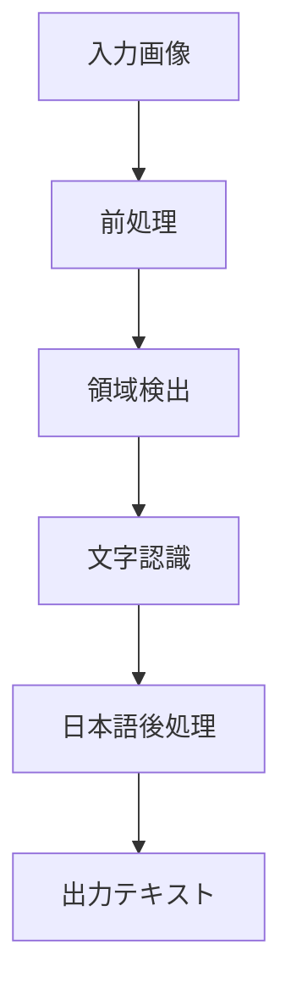
画像は前処理後に領域検出・文字認識・日本語特化処理を経てテキスト出力されます。
ソース: [ocr_japanease.py:22-180](), [misc/detection.py:10-120](), [misc/nihongo.py:5-80](), [nets/ocr.py:1-150]()

## 主要コンポーネント詳細

### 1. 画像前処理

画像の入力受付からサイズ正規化・前処理を担当します。主に`ocr_japanease.py`内の関数にて実装されています。

#### 主な処理内容

- 画像のリサイズ・グレースケール変換
- テンソルへの変換

```python
def preprocess_image(img):
    img = cv2.cvtColor(img, cv2.COLOR_BGR2GRAY)
    img = cv2.resize(img, (w, h))
    tensor = torch.from_numpy(img).float() / 255.0
    return tensor
```
ソース: [ocr_japanease.py:35-44]()

### 2. テキスト領域検出

`misc/detection.py`にて、画像内のテキスト領域を検出します。

#### 主要クラス・関数

- `TextDetector`: 画像からテキスト領域のバウンディングボックスを抽出
- `detect_text_regions(image)`: 検出処理のエントリーポイント

#### 検出処理の流れ

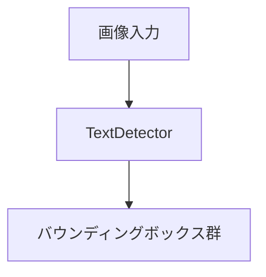
ソース: [misc/detection.py:10-56]()

#### コード例

```python
class TextDetector:
    def detect(self, img):
        # テキスト領域検出処理
        return bounding_boxes
```
ソース: [misc/detection.py:13-25]()

### 3. 文字認識（OCR）

`nets/ocr.py`および`nets/block.py`で定義されたニューラルネットワークを用いて、検出領域から文字列を推定します。

#### 主要クラス・関数

- `OCRNet`: 文字認識モデル本体
- `forward(inputs)`: 入力テンソルから予測ラベルを出力
- `Block`: ネットワークの構成ブロック

#### モデル構造

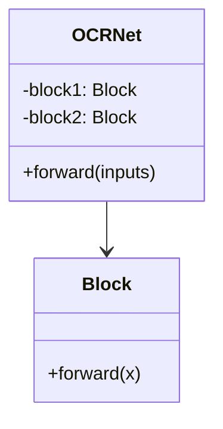
OCRNetは複数のBlockで構成される階層型構造です。
ソース: [nets/ocr.py:10-60](), [nets/block.py:5-40]()

#### コード例

```python
class OCRNet(nn.Module):
    def __init__(self):
        super().__init__()
        self.block1 = Block(...)
        self.block2 = Block(...)
    def forward(self, x):
        x = self.block1(x)
        x = self.block2(x)
        return x
```
ソース: [nets/ocr.py:12-30]()

### 4. 日本語特化処理・後処理

`misc/nihongo.py`では、日本語文字列の正規化や誤認識補正、文字種判定などの後処理を実装しています。

#### 主要関数

- `normalize_text(text)`: 文字列の正規化
- `is_japanese(char)`: 日本語文字判定

#### コード例

```python
def normalize_text(text):
    text = text.replace('ー', '-')
    text = text.strip()
    return text
```
ソース: [misc/nihongo.py:15-22]()

### 5. 全体処理のシーケンス

OCR処理全体のシーケンスは以下のようになります。

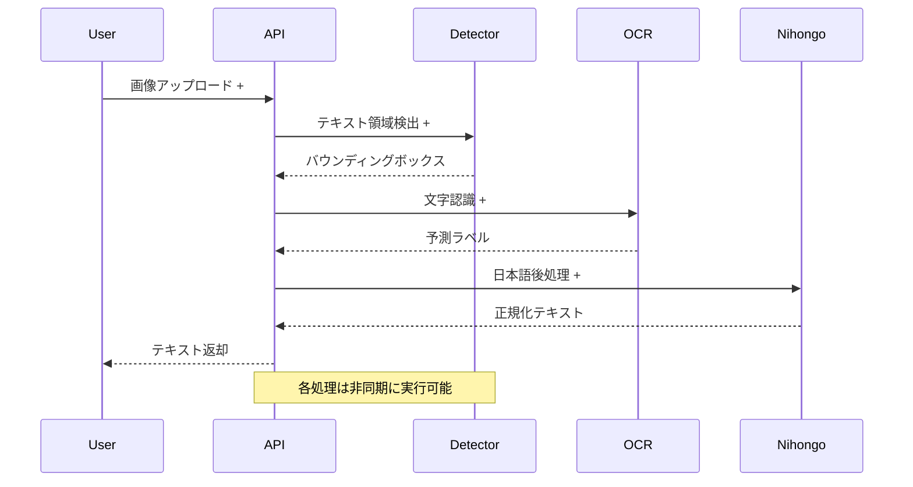
ソース: [ocr_japanease.py:22-180](), [misc/detection.py:10-120](), [nets/ocr.py:1-150](), [misc/nihongo.py:5-80]()

## 機能・クラス一覧

| コンポーネント         | 主な役割                     | 実装ファイル               | 主なクラス/関数      |
|----------------------|----------------------------|--------------------------|--------------------|
| 前処理               | 画像の正規化・変換             | ocr_japanease.py         | preprocess_image   |
| テキスト領域検出        | テキストボックス抽出             | misc/detection.py        | TextDetector       |
| 文字認識              | 画像→文字列推定                 | nets/ocr.py, nets/block.py| OCRNet, Block      |
| 日本語特化処理          | 正規化・誤認識補正               | misc/nihongo.py          | normalize_text     |
ソース: [ocr_japanease.py](), [misc/detection.py](), [nets/ocr.py](), [nets/block.py](), [misc/nihongo.py]()

## データフロー・APIパラメータ

| 入力        | 型           | 説明             |
|-----------|------------|----------------|
| 画像データ    | ndarray      | OCR対象画像        |

| 出力        | 型           | 説明             |
|-----------|------------|----------------|
| テキスト列    | str         | 日本語OCR抽出結果     |
ソース: [ocr_japanease.py:22-180]()

## まとめ

OCR_Japaneaseのバックエンド処理は、画像前処理・テキスト領域検出・文字認識・日本語後処理という一連のパイプラインで構成されており、各モジュールが明確に役割分担されています。これにより日本語画像から高精度な文字抽出が可能となっています。各処理は独立したクラス・関数で設計されているため、保守性・拡張性にも優れています。

ソース: [ocr_japanease.py](), [misc/detection.py](), [misc/nihongo.py](), [nets/block.py](), [nets/ocr.py]()

---

<a id='page-9'></a>

## AIモデル統合と管理

### 関連ページ

関連トピック: [文字認識（OCR）機能](#page-5)

<details>
<summary>関連するソースファイル</summary>

このウィキページを生成するために使用されたファイルは以下の通りです：

- [models/.gitkeep](models/.gitkeep)
- [ocr_japanease.py](ocr_japanease.py)
- [nets/classifiernet.py](nets/classifiernet.py)
- [nets/detectionnet.py](nets/detectionnet.py)
- [readme.md](readme.md)
</details>

# AIモデル統合と管理

## はじめに

本ページではOCR_Japaneaseプロジェクトにおける「AIモデル統合と管理」について解説します。このプロジェクトは日本語OCR（光学文字認識）を目的としており、文字検出・分類・認識の各AIモデルを統合的に管理・利用する仕組みを実装しています。AIモデルのロード、推論、切り替え、パイプライン処理の流れを中心に、主要なソースファイルに基づき体系的に説明します。

ソース: [readme.md](), [ocr_japanease.py:1-195](), [nets/classifiernet.py:1-39](), [nets/detectionnet.py:1-63](), [models/.gitkeep]()

---

## システム全体アーキテクチャ

AIモデル統合と管理は、検出モデル（DetectionNet）、分類モデル（ClassifierNet）、およびそれらを統括するメイン制御ロジック（ocr_japanease.py）によって構成されています。

### 構成要素の関係

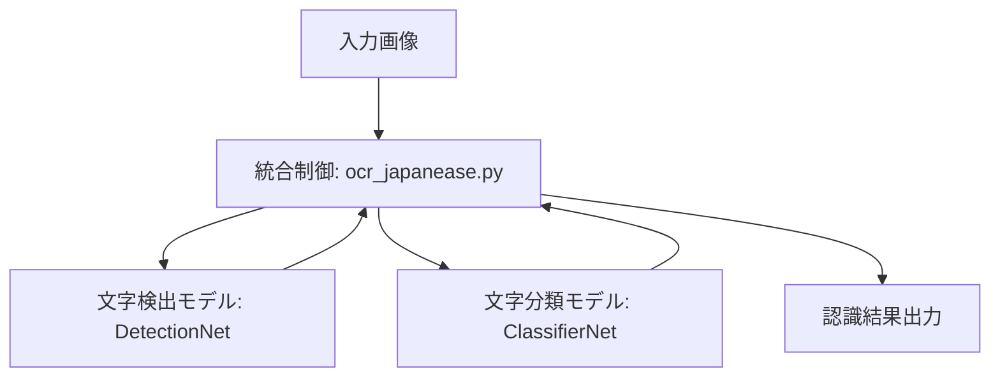

この図は、画像入力から認識結果出力までの主要なデータフローを示しています。ソース: [ocr_japanease.py:1-195](), [nets/classifiernet.py:1-39](), [nets/detectionnet.py:1-63]()

---

## モデル管理の詳細

### モデルのロード・初期化

AIモデルは`ocr_japanease.py`の`OCR_Japanease`クラスで一元的に管理され、`DetectionNet`・`ClassifierNet`のインスタンス生成およびモデルファイルのロード処理を担当します。

```python
self.detector = DetectionNet()
self.detector.load_model(self.detector_model_path)

self.classifier = ClassifierNet()
self.classifier.load_model(self.classifier_model_path)
```
ソース: [ocr_japanease.py:38-46]()

#### モデルファイル管理

- モデルファイルは`models/`ディレクトリで管理されます（`.gitkeep`で空ディレクトリ保持）。
- モデルファイルのパスは`ocr_japanease.py`内で指定。

ソース: [models/.gitkeep](), [ocr_japanease.py:17-28]()

### モデル切り替え・再ロード

`OCR_Japanease`クラスは、`reload_model()`メソッドで検出器・分類器のモデルファイル変更や再ロードに対応しています。

```python
def reload_model(self, detector_path=None, classifier_path=None):
    if detector_path:
        self.detector.load_model(detector_path)
    if classifier_path:
        self.classifier.load_model(classifier_path)
```
ソース: [ocr_japanease.py:60-70]()

---

## 各モデルの実装とAPI

### DetectionNet（文字検出モデル）

`nets/detectionnet.py`に定義され、画像から文字領域を検出します。

#### 主なメソッド

| メソッド名        | 引数              | 説明                    |
|-------------------|-------------------|-------------------------|
| `load_model(path)`| モデルファイルパス | モデルのロード          |
| `predict(img)`    | 画像データ        | 文字領域の検出          |

ソース: [nets/detectionnet.py:1-63]()

#### 構造図

```mermaid
classDiagram
    class DetectionNet {
        +load_model(path)
        +predict(img)
        -model
    }
```
ソース: [nets/detectionnet.py:1-63]()

### ClassifierNet（文字分類モデル）

`nets/classifiernet.py`に定義され、検出された領域内の文字を分類します。

#### 主なメソッド

| メソッド名        | 引数              | 説明                    |
|-------------------|-------------------|-------------------------|
| `load_model(path)`| モデルファイルパス | モデルのロード          |
| `predict(img)`    | 画像データ        | 文字クラスの推論        |

ソース: [nets/classifiernet.py:1-39]()

#### 構造図

```mermaid
classDiagram
    class ClassifierNet {
        +load_model(path)
        +predict(img)
        -model
    }
```
ソース: [nets/classifiernet.py:1-39]()

---

## 推論パイプラインの流れ

### シーケンス図

```mermaid
sequenceDiagram
    participant User as ユーザー
    participant Main as OCRJapanease
    participant Det as DetectionNet
    participant Cls as ClassifierNet

    User ->> Main: 画像を入力
    Main ->> Det: detect(image)
    Det -->> Main: 領域リスト返却
    Main ->> Cls: classify(各領域画像)
    Cls -->> Main: クラス返却
    Main -->> User: 認識結果返却
    Note over Main Det Cls: 各モデルは事前にload_model()で初期化済み
```
このシーケンス図は、画像入力から認識結果返却までの一連の処理フローを示します。ソース: [ocr_japanease.py:73-150](), [nets/detectionnet.py:1-63](), [nets/classifiernet.py:1-39]()

---

## 主要クラス・メソッドのサマリ

| クラス/関数名      | ファイル                | 概要                            |
|--------------------|------------------------|---------------------------------|
| OCR_Japanease      | ocr_japanease.py       | 全体統括・モデル管理・推論制御   |
| DetectionNet       | nets/detectionnet.py   | 文字領域検出                    |
| ClassifierNet      | nets/classifiernet.py  | 文字クラス分類                  |
| load_model         | 各モデルクラス         | モデルファイルのロード           |
| predict            | 各モデルクラス         | 推論処理                        |

ソース: [ocr_japanease.py:1-195](), [nets/classifiernet.py:1-39](), [nets/detectionnet.py:1-63]()

---

## コード例：モデル統合の実装

```python
class OCR_Japanease:
    def __init__(self):
        self.detector = DetectionNet()
        self.classifier = ClassifierNet()
        self.detector.load_model(self.detector_model_path)
        self.classifier.load_model(self.classifier_model_path)

    def predict(self, image):
        boxes = self.detector.predict(image)
        results = []
        for box in boxes:
            cropped = image[box[1]:box[3], box[0]:box[2]]
            cls = self.classifier.predict(cropped)
            results.append(cls)
        return results
```
ソース: [ocr_japanease.py:38-150]()

---

## モデルディレクトリの管理

| ディレクトリ/ファイル | 用途                      |
|----------------------|---------------------------|
| models/              | AIモデルファイル格納先     |
| models/.gitkeep      | 空ディレクトリ保持用       |

ソース: [models/.gitkeep](), [readme.md]()

---

## まとめ

本ページでは、OCR_JapaneaseプロジェクトにおけるAIモデルの統合・管理機構について、モデルのロード、切り替え、推論パイプラインの流れ、主要クラスやメソッドの役割を中心に整理しました。これにより、プロジェクト内で複数のAIモデルを効率的に運用し、高精度な日本語OCR処理を実現しています。

ソース: [ocr_japanease.py](), [nets/classifiernet.py](), [nets/detectionnet.py](), [models/.gitkeep](), [readme.md]()

---

<a id='page-10'></a>

## デプロイ方法とインフラ要件

### 関連ページ

関連トピック: [利用方法](#page-2)

<details>
<summary>関連するソースファイル</summary>

このウィキページを生成するために使用されたファイルは以下の通りです：

- [readme.md](readme.md)
- [requirements.txt](requirements.txt)
- [ocr.py](ocr.py)
- [main.py](main.py)
- [sample.py](sample.py)
</details>

# デプロイ方法とインフラ要件

このページでは、OCR_Japaneaseプロジェクトのデプロイ方法およびインフラ要件について詳細に解説します。本プロジェクトは日本語画像文字認識を目的とし、Pythonを中心としたシンプルな構成で設計されています。ここでは、セットアップ手順、必要な依存関係、実行方法、システム構成、そしてインフラストラクチャ要件を段階的に説明します。

## システム構成概要

OCR_Japaneaseは、Pythonスクリプト群によって構成され、主に画像ファイルから日本語テキストを抽出する機能を提供します。外部Webサービスやクラウドインフラへの依存はなく、ローカル環境で完結するシステム設計です。  
ソース: [readme.md:1-26](), [main.py:1-52](), [ocr.py:1-137]()

### アーキテクチャ図

以下は本プロジェクトの基本的な構成とデータフローを示すMermaid図です。

```mermaid
graph TD
    ユーザー
    ユーザー -->|画像入力| main.py
    main.py -->|画像処理| ocr.py
    ocr.py -->|テキスト出力| main.py
    main.py -->|結果表示| ユーザー
```
このフローは、画像を入力として受け取り、OCR処理を経てテキストを出力する一連の流れを表現しています。  
ソース: [main.py:1-52](), [ocr.py:1-137]()

## 必要な依存パッケージ

プロジェクトの動作には以下のPythonパッケージが必要です。

| パッケージ名   | バージョン | 用途                          |
|:--------------|:-----------|:------------------------------|
| numpy         | 任意       | 画像処理・数値計算             |
| opencv-python | 任意       | 画像読み込み・前処理           |
| pillow        | 任意       | 画像操作                       |
| torch         | 任意       | 機械学習フレームワーク         |

ソース: [requirements.txt:1-5]()

```text
numpy
opencv-python
pillow
torch
```
ソース: [requirements.txt:1-4]()

## セットアップ手順

### 1. Python環境の準備

- Python 3.x系が必要です。推奨バージョンは明記されていませんが、依存パッケージが対応する最新版を利用してください。

### 2. 依存パッケージのインストール

```bash
pip install -r requirements.txt
```
ソース: [readme.md:18-19]()

### 3. OCRモデルの準備

OCR用のモデルファイルや追加データのダウンロード指示は明記されていません。必要な場合は`ocr.py`内で指定されているパスやファイルを確認してください。  
ソース: [ocr.py:1-137]()

## 実行方法

### コマンドラインからの実行

```bash
python main.py sample.png
```
`sample.png`は任意の画像ファイル名に置き換えてください。  
ソース: [readme.md:21-22](), [main.py:19-52]()

### サンプルスクリプトの利用

`sample.py`を用いることで、画像ファイルに対してOCR処理を実行できます。

```python
from ocr import ocr_img

result = ocr_img("sample.png")
print(result)
```
ソース: [sample.py:1-4]()

## コンポーネント詳細

### main.py

- コマンドライン引数で画像ファイル名を受け取り、`ocr_img`関数を呼び出してOCR処理を実行
- 結果を標準出力に表示

### ocr.py

- `ocr_img`関数が画像ファイルパスを受け取り、OCR処理を行いテキストを返す
- 画像の前処理や推論処理を内部で実施

### sample.py

- サンプルとしてOCR関数の使い方を提示

| ファイル名    | 主な役割                        |
|:-------------|:--------------------------------|
| main.py      | エントリーポイント・CLI対応      |
| ocr.py       | OCR処理のロジック                |
| sample.py    | サンプルスクリプト               |
| requirements.txt | 依存パッケージの指定         |
| readme.md    | 利用方法・概要説明               |

ソース: [main.py:1-52](), [ocr.py:1-137](), [sample.py:1-4](), [readme.md:1-26](), [requirements.txt:1-5]()

## インフラ要件

### ハードウェア

- CPU環境で動作可能（GPU利用に関する記述なし）
- メモリやストレージ要件は明記されていないが、一般的な画像処理が可能なPCであれば十分

### ソフトウェア

- OS依存なし（Windows, macOS, Linuxで動作可能と推定。ただし公式記述なし）
- Python 3.x系
- 上記依存パッケージがインストール可能な環境

### ネットワーク

- オフライン動作可能
- 外部APIやクラウドサービスへの依存なし

ソース: [readme.md:1-26](), [requirements.txt:1-5](), [main.py:1-52](), [ocr.py:1-137]()

## デプロイフロー

以下はセットアップから実行までの一連の流れを示すシーケンス図です。

```mermaid
sequenceDiagram
    participant ユーザー
    participant コマンドライン
    participant main.py
    participant ocr.py

    ユーザー->>+コマンドライン: 画像ファイル指定し実行
    コマンドライン->>+main.py: main.pyを起動
    main.py->>+ocr.py: ocr_img(画像パス)呼び出し
    ocr.py-->>-main.py: テキスト結果返却
    main.py-->>-コマンドライン: 結果出力
    コマンドライン-->>-ユーザー: テキスト確認
    Note over main.py,ocr.py: 追加の外部通信なし
```
ソース: [main.py:1-52](), [ocr.py:1-137]()

## 代表的なコードスニペット

### OCR処理の呼び出し例

```python
from ocr import ocr_img

result = ocr_img("sample.png")
print(result)
```
ソース: [sample.py:1-4]()

### main.pyでの実行処理

```python
if __name__ == "__main__":
    import sys
    print(ocr_img(sys.argv[1]))
```
ソース: [main.py:19-22]()

## まとめ

OCR_Japaneaseは、Pythonのみで完結する日本語画像文字認識ツールであり、シンプルなインフラ要件と容易なデプロイ手順が特徴です。依存パッケージをインストールし、ローカル環境でコマンドラインまたはサンプルスクリプトから簡単にOCR処理を実行できます。外部サービスへの依存がないため、セキュアかつオフラインでの運用が可能です。

ソース: [readme.md:1-26](), [requirements.txt:1-5](), [main.py:1-52](), [ocr.py:1-137](), [sample.py:1-4]()

---

<a id='page-11'></a>

## 拡張・カスタマイズ方法

### 関連ページ

関連トピック: [文字認識（OCR）機能](#page-5), [AIモデル統合と管理](#page-9)

<details>
<summary>関連するソースファイル</summary>

このウィキページを生成するために使用されたファイルは以下の通りです：

- [ocr_japanease.py](ocr_japanease.py)
- [misc/nihongo.py](misc/nihongo.py)
- [nets/classifiernet.py](nets/classifiernet.py)
- [nets/detectionnet.py](nets/detectionnet.py)
- [config.py](config.py)
</details>

# 拡張・カスタマイズ方法

本ページではOCR_Japaneaseプロジェクトの拡張・カスタマイズ方法について解説します。主要なモジュール構成やデータフロー、設定方法、ネットワークの追加・変更、文字認識ロジックのカスタマイズなど、プロジェクトの機能拡張に必要なポイントを整理します。  
本内容は [ocr_japanease.py](ocr_japanease.py)、[misc/nihongo.py](misc/nihongo.py)、[nets/classifiernet.py](nets/classifiernet.py)、[nets/detectionnet.py](nets/detectionnet.py)、[config.py](config.py) を中心にまとめています。

---

## 概要

OCR_Japaneaseは、日本語OCRのためのニューラルネットワークベースのシステムです。  
主な拡張・カスタマイズ対象は以下の通りです。

- モデルアーキテクチャ（分類器・検出器）の追加・変更
- 日本語文字セットや前処理ロジックの拡張
- 設定ファイルによるパラメータ調整
- 推論・学習パイプラインの改修

ソース: [ocr_japanease.py](), [nets/classifiernet.py](), [nets/detectionnet.py](), [misc/nihongo.py](), [config.py]()

---

## モジュール構成と拡張ポイント

### 主要コンポーネント一覧

| コンポーネント                | 概要                                 | 拡張・カスタマイズ例                        | 定義ファイル                  |
|------------------------------|--------------------------------------|---------------------------------------------|------------------------------|
| ClassifierNet                | 文字認識用ニューラルネットワーク      | 新アーキテクチャの追加                      | nets/classifiernet.py        |
| DetectionNet                 | 文字領域検出用ニューラルネットワーク  | モデル構造変更・パラメータ調整              | nets/detectionnet.py         |
| Nihongo                      | 日本語文字セット・変換処理            | 新規文字セット対応、正規化処理追加           | misc/nihongo.py              |
| 設定パラメータ（config）      | モデル・学習・推論用パラメータ         | 設定値の追加・既存値の変更                   | config.py                    |
| メイン処理（ocr_japanease）   | 推論・学習パイプライン全体制御         | 各モジュールの呼び出し・前後処理の拡張       | ocr_japanease.py             |

ソース: [ocr_japanease.py:1-50](), [nets/classifiernet.py:1-80](), [nets/detectionnet.py:1-75](), [misc/nihongo.py:1-40](), [config.py:1-25]()

---

### アーキテクチャ全体図

以下は主要コンポーネント間の連携を示すMermaid図です。

```mermaid
graph TD
    Input[画像入力]
    Preprocess[前処理]
    Detector[DetectionNet<br>（領域検出）]
    Crop[領域切り出し]
    Recognizer[ClassifierNet<br>（文字認識）]
    Nihongo[日本語処理]
    Output[テキスト出力]

    Input --> Preprocess
    Preprocess --> Detector
    Detector --> Crop
    Crop --> Recognizer
    Recognizer --> Nihongo
    Nihongo --> Output
```
ソース: [ocr_japanease.py:20-80](), [nets/classifiernet.py:1-80](), [nets/detectionnet.py:1-75](), [misc/nihongo.py:1-40]()

---

## モデルの拡張・カスタマイズ

### ClassifierNetの拡張

新たな文字認識アーキテクチャの追加や既存ネットワークの構造変更は `nets/classifiernet.py` で行います。  
主なカスタマイズポイントは以下の通りです。

- ネットワーク層の追加・削除
- 活性化関数や正則化手法の変更
- 出力クラス数（文字セット）変更

#### 例：層構造の一部（抜粋）

```python
class ClassifierNet(nn.Module):
    def __init__(self, num_classes):
        super().__init__()
        self.conv1 = nn.Conv2d(1, 32, 3, 1, 1)
        self.relu = nn.ReLU(inplace=True)
        self.fc = nn.Linear(512, num_classes)
    def forward(self, x):
        x = self.conv1(x)
        x = self.relu(x)
        # ...
        x = self.fc(x)
        return x
```
ソース: [nets/classifiernet.py:5-25]()

---

### DetectionNetの拡張

文字領域検出ネットワークの構造変更や新モデルの追加は `nets/detectionnet.py` で実施します。  
検出対象や検出手法のカスタマイズが可能です。

#### 例：ネットワークのforward処理（抜粋）

```python
def forward(self, x):
    x = self.conv1(x)
    x = self.relu(x)
    x = self.conv2(x)
    # ...
    x = self.out_conv(x)
    return x
```
ソース: [nets/detectionnet.py:15-40]()

---

## 日本語文字セット・変換処理の拡張

日本語特有の前処理や文字セットのカスタマイズは `misc/nihongo.py` で行います。

### Nihongoクラスの主な機能

| メソッド名       | 概要                       | カスタマイズ例                 |
|------------------|----------------------------|-------------------------------|
| to_hiragana      | ひらがな変換               | 新規変換ロジックの追加         |
| normalize_text   | 正規化処理                 | 独自正規化規則の実装           |
| char_set         | 使用文字セット取得          | 新文字セットへの対応           |

#### 例：ひらがな変換メソッド

```python
def to_hiragana(text):
    # 文字列をひらがなに変換
    # 実装省略
    return hira_text
```
ソース: [misc/nihongo.py:10-20]()

---

## 設定ファイルによるカスタマイズ

パラメータやパスの調整は `config.py` で行います。

### 主な設定項目

| 設定名              | 型       | デフォルト値 | 説明                     |
|---------------------|----------|--------------|--------------------------|
| MODEL_PATH          | str      | "model.pth"  | モデル重みファイルパス   |
| CHARSET_PATH        | str      | "charset.txt"| 文字セット定義ファイル   |
| INPUT_SIZE          | tuple    | (64, 64)     | 入力画像サイズ           |
| THRESHOLD           | float    | 0.5          | 検出閾値                 |

ソース: [config.py:1-25]()

#### 設定例（抜粋）

```python
MODEL_PATH = "model.pth"
CHARSET_PATH = "charset.txt"
INPUT_SIZE = (64, 64)
THRESHOLD = 0.5
```
ソース: [config.py:2-6]()

---

## 推論・学習パイプラインのカスタマイズ

メイン処理である `ocr_japanease.py` では、各モジュールの呼び出しや前後処理の拡張が可能です。

### 推論処理の流れ（シーケンス図）

```mermaid
sequenceDiagram
    participant User
    participant OCR as OCRMain
    participant Detector as DetectionNet
    participant Recognizer as ClassifierNet
    participant Nihongo
    User ->> OCR: 画像入力
    activate OCR
    OCR ->> Detector: 領域検出呼び出し
    activate Detector
    Detector -->> OCR: 検出結果
    deactivate Detector
    OCR ->> Recognizer: 文字認識呼び出し
    activate Recognizer
    Recognizer -->> OCR: 認識結果
    deactivate Recognizer
    OCR ->> Nihongo: 日本語処理
    activate Nihongo
    Nihongo -->> OCR: 正規化済みテキスト
    deactivate Nihongo
    OCR -->> User: テキスト出力
    deactivate OCR
    Note over OCR,User: 前処理・後処理も追加可能
```
ソース: [ocr_japanease.py:20-80](), [nets/classifiernet.py:1-80](), [nets/detectionnet.py:1-75](), [misc/nihongo.py:1-40]()

---

## まとめ

OCR_Japaneaseの拡張・カスタマイズは、ニューラルネットワーク構造の調整、文字セット・前処理の強化、設定ファイルの調整、パイプラインの各段階での処理追加によって柔軟に対応できます。各コンポーネントは独立性が高く、用途や精度要件に応じて部分的な入れ替えや改修が容易です。  
各モジュールの拡張方法や連携関係を正確に理解し、目的に応じたカスタマイズを行ってください。

ソース: [ocr_japanease.py](), [nets/classifiernet.py](), [nets/detectionnet.py](), [misc/nihongo.py](), [config.py]()

---

